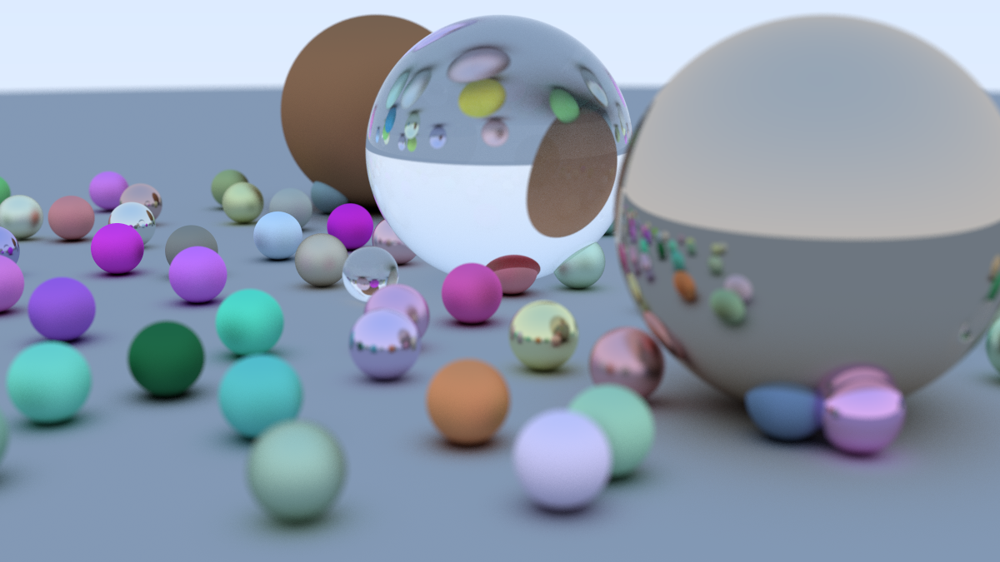

# goraytracer
`goraytracer` is a yet another implemention of "Ray Tracing in One Weekend" book [1]. I highly recommend it for everybody who is interested in learning the fundamentals of ray tracing. In the end of the book 1, you can create some cool looking images like this one: 


# How to install?
```bash
$ go get github.com/eozer/goraytracer/cmd/goraytracer
```

# How to use?
`goraytracer` generates an image in `.ppm` file format [2] by writing pixel data to stdout. To generate an image, you can pipe the output to a file:
```bash
$ ./goraytracer > output.ppm
```

You can later on convert `output.ppm` to other file formats. For example, I used `pnmtopng` to convert the images under assets/ directory from .ppm to .png format.


# References
* [Ray Tracing in One Weekend](https://raytracing.github.io/)
* [ppm](http://netpbm.sourceforge.net/doc/ppm.html)


# License
GNU LESSER GENERAL PUBLIC LICENSE.
